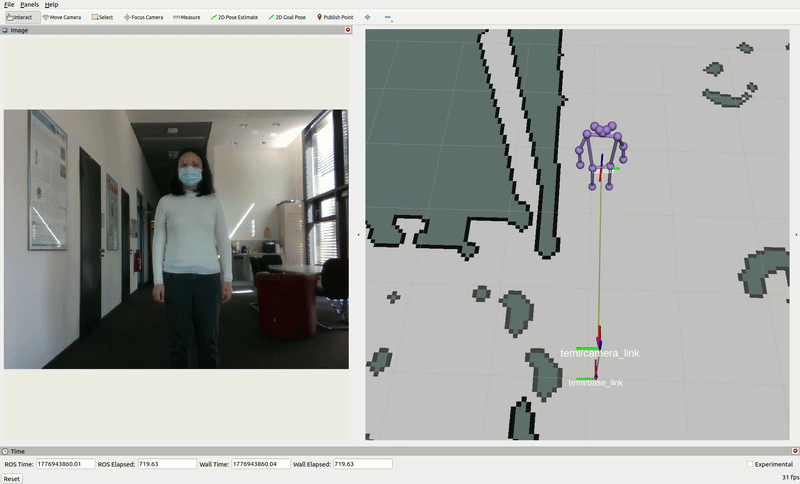
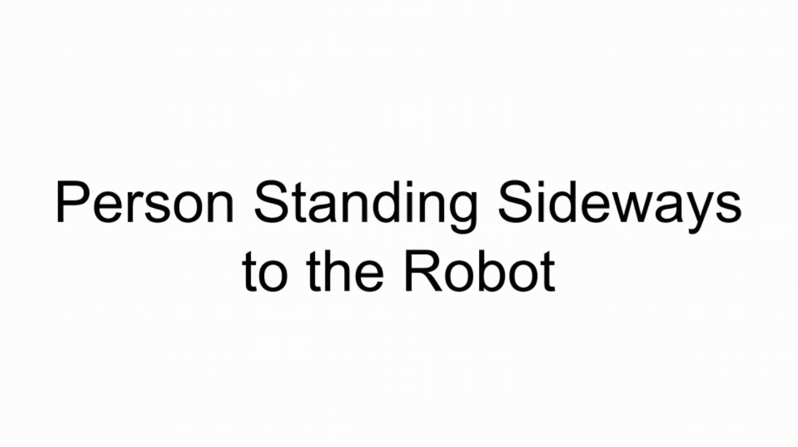

# Human-Robot-Pose-Alignment
This is the code repository for the paper Human-Robot Pose Alignment Based on Orientation Estimation and F-Formation published on the 9th Iberian Robotics Conference (ROBOT2026).

<div style="display:flex; gap:10px;">
  
  
</div>

## Human Orientation (Yaw) Estimation
Pipeline: [2D Joints Estimation](./person_pub/person_pub/bodyposenet_onnx_node.py) → [3D Joints from Depth](./person_pub/person_pub/depth_fusion.py) → [Joints Filtering](./person_pub/person_pub/pose_filter_node.py) → [Position $(x, y)$ + Orientation $(yaw)$ Estimation](./person_pub/person_pub/person_pub.py). 
```
ros2 launch person_pub person_pub.launch.py
```

* The 2D Joints Estimation node can be replaced by any other models, as long as it uses COCO17 format. If other formats are being used, one can map the other formats to COCO17. 

## Robot Navigation Goal Generation
It publishes `/goal_pose` triggered by a service `/publish_goal`. 
```
ros2 run interactive_nav_goal flexible_interactive_goal.py
ros2 service call /publish_goal std_srvs/srv/Trigger "{}"
```
* [Guassian-smoothed Histogram of Robot Positions for Interaction](./interactive_nav_goal/utils/interaction_positions_gaussian_filtered.npy).
* [F-formations](./interactive_nav_goal/utils/fformation_gaus.py)

## Citation
```
```